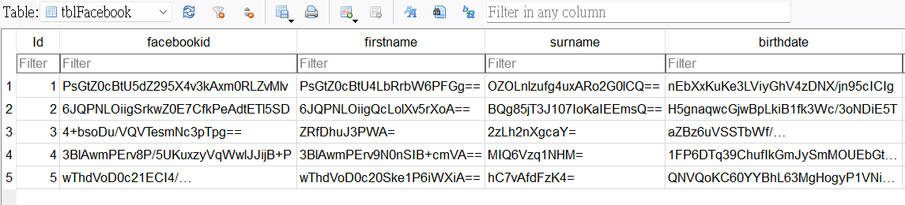
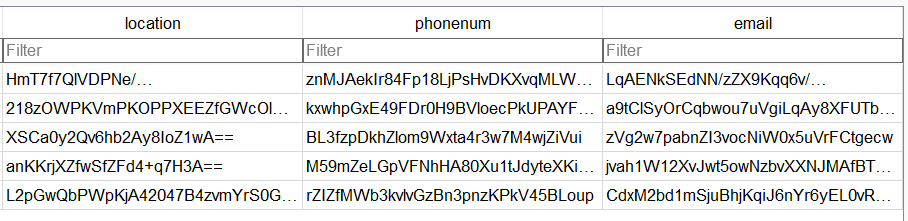
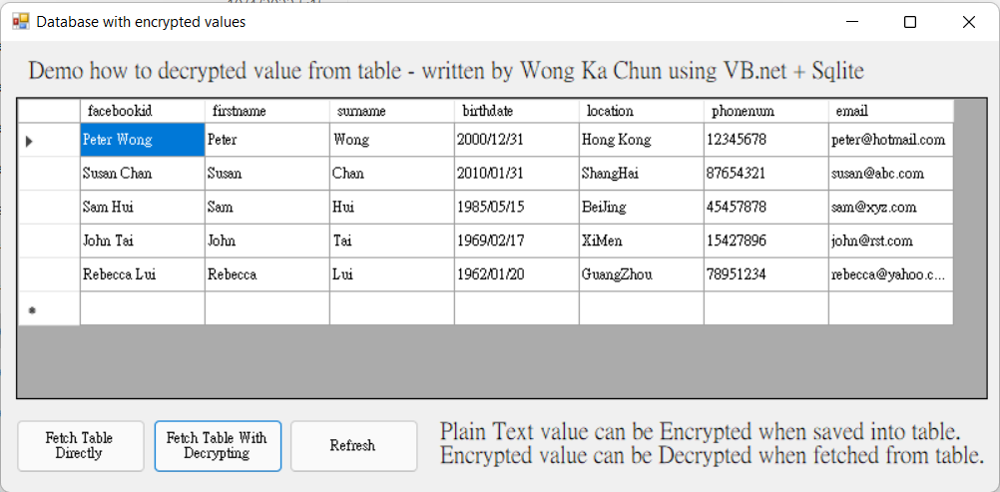
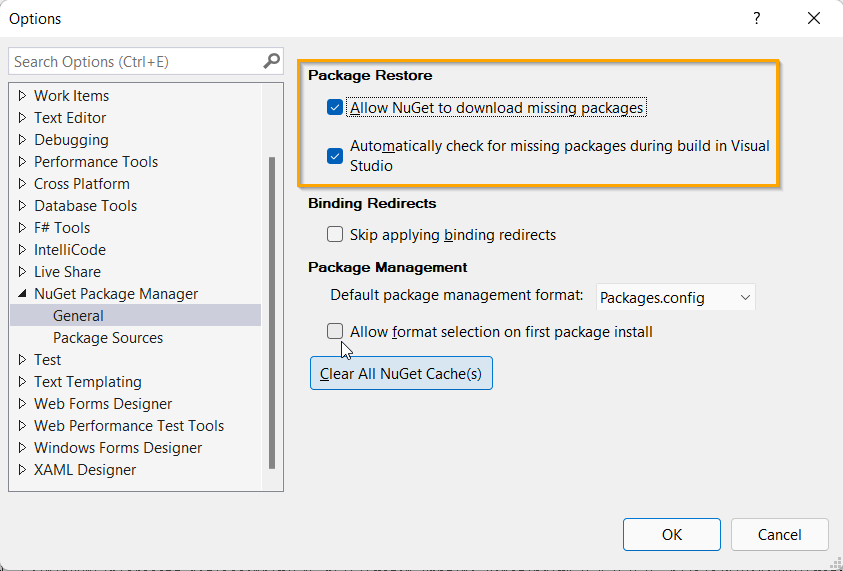
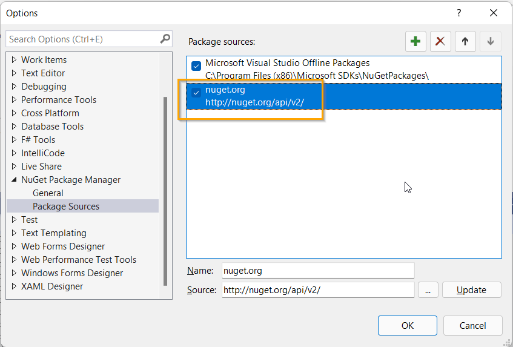

# Encrypted before saving and Decrypted before display 

## (A) Encryption method:
Triple Data Encryption Algorithm (3DEA)

## (B) Before inserting data into table, **encrypted** it:

## (C) Before fetching data from table, **decrypted** it:

## (D) When you download and build projSqlite01 in Visual Studio:

Go to: Tools -> NuGet Package Manager -> Package Manager Settings

Make sure tick all checkboxes in Package restore.

Make sure package sources includes http://nuget.org/api/v2/

